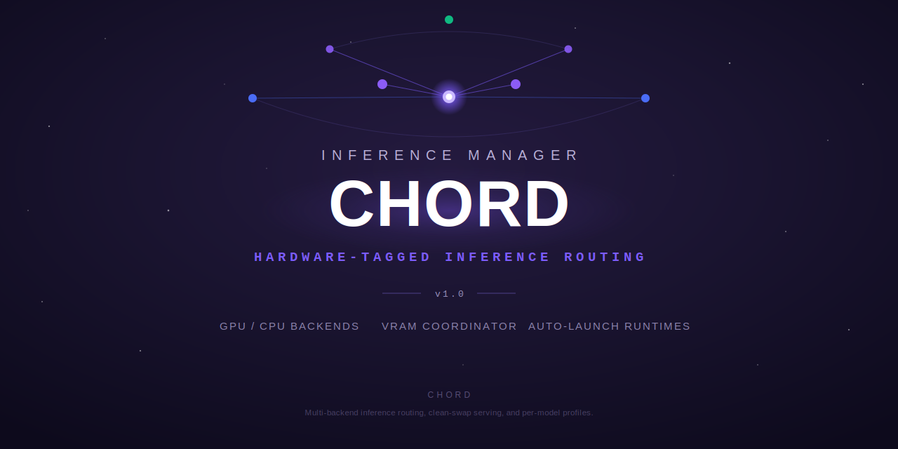

# Chord

Inference manager for local LLM fleets on unified-memory hardware.

## Overview

Chord is the inference manager for the Lumina / Harmony stack. It fronts one or
more local LLM backends and decides, per request, **which model runs on which
backend, with which launch flags, and whether it can fit in memory at all**.

Lumina runs interactive assistant workloads; Harmony runs agentic coder
workloads. Both share the same finite pool of accelerator memory on
unified-memory APUs, where a single misjudged context size or a leaked process
can starve the next model. Chord exists to make that sharing safe and
deterministic: it measures each model's serving profile, routes accordingly,
admits work only when memory genuinely allows, swaps models cleanly, and tracks
the operating mode of the whole fleet.

Chord is also the constellation's **MCP tool front door**: it embeds the
`terminus-rs` tool registry and exposes it over an authenticated HTTP surface
(`/v1/tools/*`), so agents reach the build-pipeline toolset (Gitea, GitHub,
Plane, DiffusionGemma review, model-serving introspection) and the LLM backends
through one JWT-guarded service. See [MCP tool dispatch](#mcp-tool-dispatch)
below.

Chord ships as the standalone crate `chord-proxy`, extracted from the former
`lumina-constellation` monorepo into this repository.

## Architecture

Per-model serving profiles, measured by the intake harness, drive routing,
admission, and launch flags. Two front doors feed Chord Core: **Lumina**
(assistant, control plane) and **Harmony** (coders, agentic plane). Chord Core
is built from four cooperating components:

- **Routing** — serving-profile lookup selects the best runtime and the
  backend per model, with a chat-role pin so interactive traffic stays on the
  intended backend.
- **Memory Coordinator** — substrate-aware admission control. It models the
  hardware as either separate ceilings or a unified memory pool, and performs
  tier-aware eviction to make room without overcommitting.
- **Clean-Swap Launcher** — a verified teardown-then-launch cycle: tear down
  the outgoing model, verify the memory release, then launch the next model
  with an explicit `-c` context size. Includes orphan force-kill and a
  false-OOM guard so transient failures don't masquerade as real
  out-of-memory conditions.
- **Mode Controller** — tracks the operating mode with persisted state:
  *assistant-live* (pin a model and swap the rest around it) versus
  *batch-coder* (give the GPU fully to one model at a time).

Two cross-cutting subsystems wrap the core:

- **SNAP — observability & inventory** ([`src/snap`](src/snap)): a real GPU VRAM
  reader (sysfs / rocm-smi / Ollama) and engine-health poller, an on-disk GGUF +
  Ollama manifest scanner with quant detection, passive per-model activity
  observation, and a request-analytics logger with imputed cloud-cost / savings.
  It exposes a read-only observability surface on distinct paths behind Chord's
  own JWT auth, and includes a vLLM engine adapter. SNAP can optionally persist
  its streams (analytics, inventory, activity, VRAM samples) to Postgres; this is
  **default-off**, gated behind `CHORD_SNAP_PERSIST`, best-effort, and never
  fails or slows a proxied request.
- **Runtime isolation (ISO)** ([`src/supervisor`](src/supervisor)): every runtime
  Chord launches is spawned with a scrubbed environment and an explicit egress
  posture. ISO-01 scrubs telemetry/online env vars and declares the policy
  (advisory); ISO-02 enforces it in the kernel with a per-runtime network
  namespace — a `Serve` runtime gets **no route** (every external `connect()`
  fails at the kernel, so it cannot phone home even if it ignores the opt-outs),
  while a `Pull` runtime gets a constrained, nftables-filtered path to the
  configured model-source allow-list only. It is **fail-closed**: without
  `CAP_NET_ADMIN` the launch is refused rather than run with full host egress
  (an explicit, loud `CHORD_ALLOW_UNISOLATED=1` override exists, off by default).

### Model fleet manager (autonomous model curation)

Chord doesn't just route requests to a fixed set of models — it manages the
fleet's models as a living inventory across three **storage tiers**. The
file-backed registry ([`src/models/registry.rs`](src/models/registry.rs),
`ModelRegistry` / `ModelRecord` / `StorageTier`) tracks every known model as
*hot* (resident in VRAM), *warm* (on local disk, not loaded), or *cold* (only in
the archive, e.g. NFS). At startup `reconcile()` *finds* what actually exists by
walking the local and archive Ollama manifest trees — including Hugging-Face
style names (`hf.co/org/model:tag`) — and rewrites the records to match reality,
so the registry never drifts from disk. SNAP's inventory scanner
([`src/snap/inventory.rs`](src/snap/inventory.rs)) complements this with a
quant-aware sweep of GGUF and Ollama files across every configured storage
location.

Movement between tiers is automatic and safe. On a request for a cold model,
the `PullCoordinator` ([`src/models/transfer.rs`](src/models/transfer.rs))
transparently promotes it cold → warm — copying the manifest and its referenced
blobs from the archive to the local root, with a disk precheck, per-model
concurrent-pull dedup, timeout, and mid-copy cleanup so a failed pull never
leaves corrupt state. Under disk pressure the eviction sweep
([`src/models/eviction.rs`](src/models/eviction.rs)) does the reverse, archiving
the least-recently-requested warm models warm → cold, archive-first /
delete-after, never touching hot or protected models. Acquisition from outside
the host is treated as a privileged operation: a runtime that needs to *fetch* a
model runs in the `Pull` network namespace
([`src/supervisor/egress_filter.rs`](src/supervisor/egress_filter.rs)), which
gets a default-drop, nftables-filtered egress path to **only** the configured
model-source allow-list — never a baked-in host — while serving runtimes get no
route at all. The result is a self-curating model fleet: it knows what it has,
pulls what a request needs, reclaims disk when it's tight, and reaches the
network for new weights only through a locked-down, allow-listed door.

These route across a **three-tier backend stack**:

1. **llama.cpp-rocm** — the GPU tier; broadest model support and most
   VRAM-efficient. Uses `--no-mmap` and keep-warm for large models.
2. **ollama-rocm** — the GPU tier for architectures llama.cpp can't load
   (e.g. gemma, gpt-oss, glm, qwen families).
3. **CPU tier** — a genuine system-RAM fallback for small models, used as a
   last resort.

Routing prefers `llama.cpp-rocm`, falls back to `ollama-rocm`, and finally to
the CPU tier.

Alongside the ROCm GPU tiers, Chord also registers a **`vulkan`** backend — a
`llama.cpp` `llama-server` built with the Vulkan/RADV (Mesa) driver
(`-DGGML_VULKAN=ON`, Mesa 25.0.7 on `gfx1151`). It is a *driver-stable*
alternative to the ROCm-only lemonade build for **dense large models**, used when
ROCm is unavailable or unstable. It is memory-bound like HIP/ROCm (~5 tok/s at
70B), so it is intended for batch/async serving rather than interactive traffic.
Dense-large models (70B/32B-dense class; `llama3.3:70b` validated) are tagged to
it via the model registry. See
[docs/serving.md](docs/serving.md#serving-backends) for details and the validated
`llama3.3:70b` numbers.

### SLM router (DOCGEN-03)

Beyond serving/proxying chat traffic, Chord owns a standalone **SLM router**
([`src/router`](src/router)) — a small-model routing capability for in-process
callers that need a generation without picking a model themselves. This is the
mechanism behind "all documentation-engine inference routes through Chord, and
Chord decides the destination": the `moosenet/Terminus` documentation engine
(a separate spec item) only *asks* the router to generate; the router *owns*
the destination decision.

- **Policy** ([`src/router/policy.rs`](src/router/policy.rs)) is pure decision
  logic, no network I/O: an explicit, env-configured `RoutingPolicy` maps a
  request's estimated token count to one of three destinations — a local
  cheap/fast model for simple requests, a local high-context model once a
  request exceeds `SLM_ROUTER_CONTEXT_THRESHOLD_TOKENS`, or OpenRouter's
  frontier-free tier once a request exceeds even the local high-context
  ceiling (`SLM_ROUTER_LOCAL_HIGH_CTX_MAX_TOKENS`) — so a request is never
  silently truncated, only escalated.
- **Router** ([`src/router/slm_router.rs`](src/router/slm_router.rs)) resolves
  a decision to a real backend and executes the generation, reusing the
  existing backend catalogue (`models::backends::seed_from_env`) rather than
  a second one — the local destinations are just different model names sent
  to the primary Ollama-compatible backend (the same shape
  `AgenticModelRouter`'s fast/deep models already use), and the cloud
  destination reuses the existing `"openrouter"` backend's bearer-key
  indirection (`Backend::api_key_env`) unchanged.
- **Egress isolation**: every hop that would reach the cloud destination is
  checked against `SLM_ROUTER_CLOUD_EGRESS_ALLOWLIST` (comma-separated
  hostnames) *before* any network call — fail-closed, same posture as
  `supervisor::egress_policy`. `SLM_ROUTER_CLOUD_ALLOWED=false` disables cloud
  routing outright, independent of the allow-list.
- **Graceful fallback, never a silent failure**: a destination that is
  egress-denied, unconfigured, or fails at execution time falls back per
  policy (cloud → local high-context → local cheap). If every destination in
  the chain fails, `route_and_execute` returns a hard `SlmRouterError` — it
  never fabricates or silently drops a generation.
- **Logged for evaluation**: every routing decision the router acts on
  (including failed/fallback hops) is logged via `tracing` and retained
  in-memory (`SlmRouter::decisions()`) — the feed a future SLM-router
  evaluation sweep (DOCGEN-04) consumes to judge routing quality.
- The router assumes its input is already PII-swept by the caller (the doc
  engine's own PII gate) — it is not itself a PII gate, only a destination
  decision + execution layer.

Env vars: `SLM_ROUTER_CONTEXT_THRESHOLD_TOKENS` (default 6000),
`SLM_ROUTER_LOCAL_HIGH_CTX_MAX_TOKENS` (default 32000),
`SLM_ROUTER_LOCAL_HIGH_CTX_MODEL` / `SLM_ROUTER_LOCAL_CHEAP_MODEL` /
`SLM_ROUTER_CLOUD_MODEL` (model names/tags), `SLM_ROUTER_CLOUD_ALLOWED`
(default true), `SLM_ROUTER_CLOUD_EGRESS_ALLOWLIST` (default
`openrouter.ai`).

## MCP tool dispatch

Beyond model serving, Chord is the constellation's authenticated MCP tool
gateway. Every tool endpoint requires JWT auth when `CHORD_JWT_SECRET` is
configured (the same secret as the LLM calls; an empty secret disables auth for
local/dev use) and is rate-limited per role. Tool-call outcomes are recorded to
a sanitized audit log that never captures tool arguments or raw query text.

### Core registry — `/v1/tools/*`

The core catalog ([`src/catalog.rs`](src/catalog.rs)) is the merge of two
sources: MCP tools from the upstream MCP backend (`MCP_BACKEND_URL`) and the
embedded `terminus-rs` Rust registry, which acts as the fallback position
(an MCP tool wins when a name collides). The catalog is cached
(`CHORD_CATALOG_CACHE_SECS`, default 5 min).

What Chord *serves* is deliberately narrower than what it can *reach*: a static
**core allowlist** ([`src/tool_allowlist.rs`](src/tool_allowlist.rs)) scopes
`/v1/tools/list`, `/v1/tools/discover`, and `/v1/tools/call` to Chord's actual
job — the build/spec-execution pipeline (`gitea_*`, `github_*`, `plane_*`),
DiffusionGemma review (`dgem_*`), and Chord's own model-serving domain
(`model_advisor_*`, `serving_profile*`, `serving_residency*`, `model_intake*`),
plus a few built-ins. Anything off the list is excluded from `list`/`discover`
**and** rejected outright by `call`, even if a caller already knows the name.
General personal-utility / secrets / fleet-ops tools are intentionally *not*
served here — that surface belongs to Lumina core talking to Terminus directly.

- `POST /v1/tools/list` — merged, allowlisted catalog.
- `POST /v1/tools/call` — execute an allowlisted tool by name.
- `POST /v1/tools/discover` — model-free keyword search over the catalog, so a
  caller assembles a small per-turn toolset instead of the whole hub.
- `POST /v1/agent/execute` — the guarded agentic tool-calling loop.

### Personal federation — `/v1/personal/tools/*`

A second, **independent and unfiltered** `McpProxy` is federated in when
`PERSONAL_BACKEND_URL` is set, pointed at the standalone `terminus_personal`
Rust MCP binary (which self-fetches its own secrets from the vault). It is
reachable *only* at `/v1/personal/tools/list` and `/v1/personal/tools/call` and
is **never** merged into the core `/v1/tools/*` catalog — the two share auth,
rate-limiting, and audit machinery, but are separate catalogs, not one relaxed
security posture. When `PERSONAL_BACKEND_URL` is unset the personal routes
return a clean `503` (never a panic or hang), and the core catalog is provably
unchanged.

### Agentic model routing (S92 hybrid)

Chord's agentic loop ([`src/agentic/model_router.rs`](src/agentic/model_router.rs))
runs on a **fast** model by default (`CHORD_FAST_MODEL`) and escalates **once**
per execution to a **deep** model (`CHORD_DEEP_MODEL`) when a turn gets complex.
The escalation decision is *hybrid*: a cheap, deterministic keyword-and-size
heuristic (a small conservative reasoning-word list, plus tool-result-count and
total-character thresholds) is complemented by a local **Supra-Router-51M**
daemon (`SUPRA_ROUTER_URL`, deployed with the loopback-bound `dgem.service`
pattern) that classifies the same turn. The router is gated by `ROUTER_MODE`,
which **defaults to `Shadow`**: today the Supra decision is computed and logged
alongside the heuristic (shadow-vs-actual agreement reporting) but the
**heuristic still drives the actual routing**, because the 51M model's license
is unresolved — only an explicit `ROUTER_MODE=active` lets the Supra decision
lead. A user `/deep` prefix forces the deep model outright, and escalation is
capped at one per execution so a single request never thrashes VRAM.

### Embeddings — `/v1/embeddings` (EMBED-01)

`POST /v1/embeddings` is an OpenAI-compatible embeddings endpoint
([`src/embeddings.rs`](src/embeddings.rs)): `input` may be a single string or
an array of strings, and the response is the standard
`{"object":"list","data":[{"object":"embedding","embedding":[...],"index":n}],"model":...,"usage":{...}}`
shape, order-preserved. Same JWT auth as every other endpoint, and counted
against the caller's LLM rate-limit budget.

Embeddings are served **local-first** from the fleet Ollama
(`EMBED_LOCAL_URL` / `EMBED_LOCAL_MODEL`, e.g. Qwen3-Embedding) and **fall
back to OpenRouter** (`EMBED_FALLBACK_MODEL`, same Qwen3-Embedding family so
vectors from either path are compatible) whenever the local backend is
unreachable, errors, times out, or returns a vector of the wrong
dimensionality. Chord never hands back a vector whose length doesn't match
`EMBED_DIM` (default 1024) — a dimension mismatch is treated exactly like a
backend failure, and a mismatch (or any other failure) on *both* paths is a
structured `502`, never a partial or garbage response. `OPENROUTER_API_KEY`
is fetched from <secret-manager> at startup (see below) and read fresh at dispatch
time — never a literal, never logged.

| Env var | Purpose | Default |
|---|---|---|
| `EMBED_LOCAL_URL` | Full URL of the local embeddings endpoint. Unset → local disabled, every request goes straight to the fallback. | *(unset)* |
| `EMBED_LOCAL_MODEL` | Model name requested from the local backend. | `qwen3-embedding` |
| `EMBED_FALLBACK_MODEL` | Model name requested from OpenRouter. Must stay the same model family as `EMBED_LOCAL_MODEL`. | `qwen/qwen3-embedding` |
| `EMBED_FALLBACK_BASE_URL` | OpenRouter API base (no `/embeddings` suffix). | `https://openrouter.ai/api/v1` |
| `EMBED_DIM` | Expected embedding dimensionality; enforced on every vector from either backend. | `1024` |
| `EMBED_MAX_BATCH_SIZE` | Maximum number of inputs accepted per request (a `400` above this). | `256` |
| `EMBED_TIMEOUT_SECS` | Per-backend request timeout. | `30` |
| `OPENROUTER_API_KEY` | Bearer key for the OpenRouter fallback. <secret-manager>-sourced (see below), never a literal. | *(unset → fallback disabled)* |

## Secrets (own <secret-manager> client)

Chord fetches its own runtime secrets rather than having them written into a
unit file or brokered by another service. A shared, dependency-light <secret-manager>
Universal-Auth client ([`crates/chord-secrets`](crates/chord-secrets), used by
both `chord-proxy` and the `chord-tui` control client) authenticates with
Chord's own machine identity (`INFISICAL_URL` / `INFISICAL_CLIENT_ID` /
`INFISICAL_CLIENT_SECRET` plus `CHORD_INFISICAL_PROJECT_ID` /
`CHORD_INFISICAL_ENVIRONMENT` / `CHORD_INFISICAL_SECRET_PATH`). The client
itself is intentionally stateless — it authenticates fresh per call and keeps no
token cache or background refresh thread. `chord-proxy` uses it for a one-shot
startup fetch of values such as `CHORD_JWT_SECRET` / `CHORD_API_KEY` /
`OPENROUTER_API_KEY` (EMBED-01's OpenRouter fallback key); the
`chord-tui` control client wraps it in an `InfisicalSecretManager` whose TTL
cache coalesces concurrent cold-cache misses so its poll tasks never stampede
<secret-manager> with a re-auth storm. When <secret-manager> config is absent the sanctioned
env-var fallback is used — no secret is ever hardcoded.

## Status

Chord ships as the standalone Rust crate `chord-proxy`, version **1.4**. The
core inference manager — routing, the substrate-aware Memory Coordinator, the
verified Clean-Swap Launcher, the Mode Controller, the SNAP observability
subsystem, and per-runtime kernel egress isolation — is in place, as is the MCP
tool-dispatch surface, the personal federation, the S92 hybrid agentic router,
and Chord's own <secret-manager> client.

The core `/v1/tools/*` registry embeds **`terminus-rs` pinned at `1.1.0`** (the
serving-profile types + intake DB config + the tool registry), resolved from the
Gitea crate registry. That pin currently **predates** the latest Terminus
plane-helper additions (`PLANE_PAT_<NAME>` multi-identity, the shared-Redis GET
cache / rate-limit queue, the prefix registry, and the module-management tools).
A dependency bump to pick those up is **tracked and pending** — operator-gated on
the new `terminus-rs` being published to the Gitea registry, then a Chord rebuild
and redeploy. Until that lands, those newest plane-helper tools are reachable via
the standalone `terminus_personal` path (personal federation), **not** the core
`/v1/tools/*` route on the currently deployed binary. The S86 coder-fleet
benchmark charts and leaderboard are published (see
[Test Results](#test-results) below).

## Documentation

Component explainers (written from the source in [`src/`](src)) live in
[`docs/`](docs/):

- **[docs/architecture.md](docs/architecture.md)** — component deep-dive: request
  flow, Routing, backend tiers, model registry & storage tiering,
  memory/residency management, the control API, the agentic loop, and the search
  harness, each mapped to its real module/types.
- **[docs/serving.md](docs/serving.md)** — the serving / coordinator subsystem
  (Memory Coordinator, Clean-Swap Launcher, Mode Controller) mapped to the code
  that actually ships, with a present/partial/absent table.
- **[docs/egress.md](docs/egress.md)** — the runtime isolation model: ISO-01
  env-scrub + egress policy and ISO-02 per-runtime network-namespace enforcement,
  the fail-closed posture, and the honest scope boundaries.
- **[docs/snap-persistence.md](docs/snap-persistence.md)** — the optional,
  default-off SNAP → Postgres persistence layer (`CHORD_SNAP_PERSIST`).

**Sweep action-queue cache (RESIL-02, `CHORD_STATE_DIR`).** Chord caches a
sweep's planned action queue + progress cursor so a restarted sweep can resume
from Chord rather than replanning. Three JWT-gated control endpoints:
`POST /api/sweep/session` (register/upsert a queue — idempotent; same queue is a
no-op preserving progress, a different queue replaces it and resets progress),
`GET /api/sweep/session/:id` (remaining keys in queue order + counts; 404
unknown), and `POST /api/sweep/session/:id/advance` (mark keys done — append-only,
idempotent, keys not in the queue ignored). Chord only RECORDS and SERVES the
queue — it never executes it; the Terminus sweep is the executor. Backed by
[`src/sweep_session.rs`](src/sweep_session.rs), persisted to
`<CHORD_STATE_DIR>/sweep_sessions.json` (atomic tempfile+rename) when configured;
unset ⇒ in-memory only (lost on restart). Best-effort, corrupt-tolerant.

**GPU-exclusive lease durability (`CHORD_STATE_DIR`).** The GPU-exclusive lock
([`src/gpu_exclusive.rs`](src/gpu_exclusive.rs)) that hands the single host GPU to
the intake sweep is otherwise in-memory only — a Chord restart mid-sweep would drop
the lease and let a competing job slip in ("CHORD LOCK GAP DETECTED" on the harness
side). When `CHORD_STATE_DIR` is set, Chord persists the lease
(`<CHORD_STATE_DIR>/gpu_exclusive_lease.json`, atomic tempfile+rename) on every
acquire/heartbeat/release and reloads it on startup, honoring the TTL
(`CHORD_GPU_EXCLUSIVE_TTL_SECS`) so an already-abandoned lease never relocks the GPU.
Persistence is best-effort: a missing/corrupt/unwritable file never panics Chord —
it degrades to in-memory-only and logs at warn. Unset ⇒ persistence disabled (the
prior behavior). See also the sweep's Chord-backed resume in `moosenet/Terminus`.
- **[docs/test-results.md](docs/test-results.md)** — the S86 coder-fleet sweep
  results: themed BLITZ vs MULTI-FILE pass-rate charts, leaderboard, table, and
  takeaways.
- **[docs/model-testing-methodology.md](docs/model-testing-methodology.md)**
  — the full model benchmarking methodology (coder + assistant harnesses,
  scoring, judge panel, YaRN collapse detection, `mem_config` hardware
  tagging, gfx1151 backend quirks). The harness code lives in
  [`moosenet/Terminus`](../Terminus)`/src/intake/`, not in this repo.
- **[docs/assistant-results.md](docs/assistant-results.md)** — the S84 ASMT
  assistant-fleet sweep results, generated from Postgres, partial/in-progress.
- **[docs/contributing-results.md](docs/contributing-results.md)** — how to
  benchmark your own hardware and tag results so they aren't blended with
  the numbers here.
- **[docs/README.md](docs/README.md)** — the docs index.

## Test Results

Results from the **S86 coder-fleet sweep** on `gfx1151` (MINT v2 harness,
`qwen3:8b` judge) — full charts, table, and takeaways in
[`docs/test-results.md`](docs/test-results.md). Assistant-fleet results
(S84 ASMT sweep, in progress) are in
[`docs/assistant-results.md`](docs/assistant-results.md). Full methodology
in [`docs/model-testing-methodology.md`](docs/model-testing-methodology.md).

`qwen3-coder:30b` tops the fleet at **81% overall** with a perfect BLITZ score and
is now the served model on `gfx1151`; `qwen2.5-coder:14b-instruct` is the best value
at **77%**, tying the MoEs on multi-file. The completed sweep folds in the tail
models, including the standout Hugging Face find `Seed-Coder-8B` at **61%** — the
strongest multi-file showing outside the leaders for an 8B model. Multi-file
coordination is where the fleet separates, and base/general models score near zero.

## License

MIT
