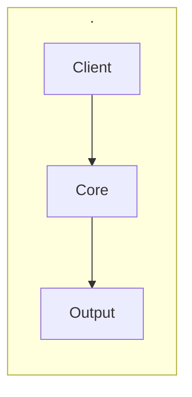

<h1 align="center">Chord</h1>

<em>Inference manager for local LLM fleets on unified-memory hardware.</em>

   

Docs · Quickstart · Reference · Architecture · [Changelog](CHANGELOG.md)

---

## Why CHRD

- _No benefit summary generated yet for . -- see [Architecture at a glance](#architecture-at-a-glance) below._

## Quick Start

_No quickstart content generated yet -- see Getting Started for the full tutorial._

## Architecture at a glance

. is documented in depth on the architecture page. See Architecture for the full component and data-flow breakdown.

## Contributing

See the project's build pipeline docs for the contribution process.

## License

See [LICENSE](LICENSE).

## Documentation

See [the documentation index](docs/index.md) for the full reference.

- [Overview](docs/reference/overview.md)
- [Architecture](docs/reference/architecture.md)
- [MCP tool dispatch](docs/reference/mcp-tool-dispatch.md)
