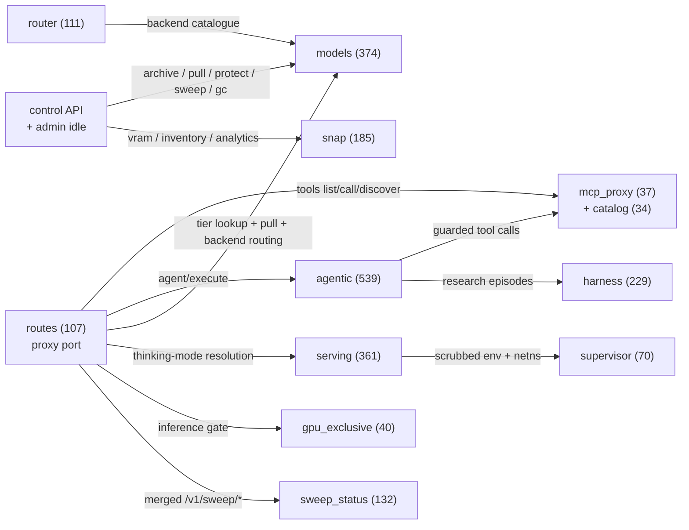

<h1 align="center">Chord</h1>

<p align="center"><em>The Lumina Constellation's inference proxy and orchestrator: one Rust process that routes LLM traffic, manages model storage and VRAM lifecycles, and dispatches MCP tools for the whole fleet.</em></p>

<p align="center">Rust · 133 modules · 3,182 KG nodes · 2,587 functions · 44 config keys · analyzed <code>f44e483</code></p>

<p align="center"><a href="docs/index.md">Docs</a> · <a href="docs/getting-started.md">Getting started</a> · <a href="docs/reference/index.md">Reference</a> · <a href="docs/architecture.md">Architecture</a> · <a href="docs/guides/index.md">Guides</a></p>

---

## What is Chord

Chord (`chord-proxy`) is the always-on backbone that sits between the fleet's agents (Lumina, Harmony, the Terminus build pipeline) and its local inference hardware. It exposes an OpenAI-compatible `POST /v1/chat/completions` front door plus an MCP tool surface (`/v1/tools/list|call|discover`), and behind those endpoints it owns every decision the callers shouldn't have to make: which backend serves a model, whether the model must first be pulled from cold archive storage, whether the request may run at all while another job holds the GPU, and whether a per-request `thinking` hint can be honored for the target model.

It is an *orchestrator*, not just a passthrough. The `models` subsystem tracks every known model across three storage tiers (hot / warm / cold) in a persistent registry, with background disk-pressure eviction, cooldown demotion, orphan-blob GC, and transparent cold→warm pulls on request. The `serving` subsystem reads per-model serving profiles and performs clean VRAM swaps (teardown → verify-release → launch) with substrate-aware memory accounting, while `supervisor` gives each launched runtime a scrubbed environment and a fail-closed network namespace. On-demand backends are started when routed to and stopped when idle — no perpetual GPU holds, including the Chord-managed DiffusionGemma daemon.

Around the core proxy sit the agent-facing capabilities: a guarded agentic tool-calling loop (`agentic`, five security guards, one-shot model escalation), a stateful research search harness (`harness`), an SLM router that picks inference destinations for the documentation engine (`router`), fleet-data-driven coding-model selection (`POST /v1/coding/select`), local-first embeddings with fallback (`/v1/embeddings`), and an operator control API (second listener) for model tiering, idle mode, and the SNAP observability surface. A ratatui control TUI (`chord-tui`) and a shared <secret-manager> client (`chord-secrets`) live in the same workspace.

## Architecture

Derived from the code knowledge graph (17 subsystems, 114 cross-subsystem call edges). Node labels carry real KG symbol counts.



`mcp_proxy` falls back to the in-process `terminus-rs` Rust tool registry when the MCP backend is unreachable; an optional second, unfiltered proxy federates a personal tool backend under `/v1/personal/tools/*` when `PERSONAL_BACKEND_URL` is set.

## Subsystems

| Subsystem | KG nodes | What it does | Reference |
|---|---|---|---|
| `agentic` | 539 | Guarded LLM↔tool loop: five security guards, one-shot fast→deep model escalation, SSE progress | [reference/agentic](docs/reference/agentic.md) |
| `models` | 374 | Storage tiering: persistent registry, eviction/GC, archive pulls, backend catalogue + on-demand lifecycle | [reference/models](docs/reference/models.md) |
| `serving` | 361 | Serving profiles, runtime launcher, VRAM residency/admission, clean swap, mode controller | [reference/serving](docs/reference/serving.md) |
| `crates/` | 339 | `chord-tui` control TUI client + `chord-secrets` <secret-manager> Universal Auth client | [reference/chord-tui](docs/reference/chord-tui.md) |
| `harness` | 229 | Harness-1 research state machine: working memory, curated evidence, VRAM rotation | [reference/harness](docs/reference/harness.md) |
| `snap` | 185 | Observability: real VRAM reader, engine health poller, model inventory, request analytics, vLLM adapter | [reference/snap](docs/reference/snap.md) |
| `sweep_status` | 132 | "Is the benchmarking sweep healthy" monitor: working/stuck/idle verdicts from GPU + DB + systemd signals | [reference/sweep_status](docs/reference/sweep_status.md) |
| `router` | 111 | SLM router: destination decisions (local high-context / local cheap / frontier-free) + routing-quality eval | [reference/router](docs/reference/router.md) |
| `routes` | 107 | Proxy-port HTTP surface: chat completions, tools, agent, embeddings, infer, coding select, GPU-exclusive | [reference/routes](docs/reference/routes.md) |
| `supervisor` | 70 | Launch posture: env scrubbing + fail-closed per-runtime network namespaces with nftables egress filtering | [reference/supervisor](docs/reference/supervisor.md) |
| `gpu_exclusive` | 40 | GPU handoff lock: external sweeps take the GPU without stopping Chord; inference paths gate with 503 | [reference/gpu_exclusive](docs/reference/gpu_exclusive.md) |
| `mcp_proxy` + `catalog` | 71 | MCP backend proxy with Rust-tool fallback registry and merged, allowlisted tool catalog | [reference/mcp_proxy](docs/reference/mcp_proxy.md) |

Smaller units (`audit`, `config`, `misc`: auth/session/validation/diffusion/embeddings/coding_proxy) are covered inside the pages above — see the [reference index](docs/reference/index.md).

## Quick start

```sh
# Build the workspace (root crate + chord-tui + chord-secrets)
cargo build --release

# The two root binaries
./target/release/chord-proxy --version
./target/release/batch-report --help
```

`chord-proxy` binds two listeners: the proxy port (`CHORD_PROXY_PORT`, default 9099) and the control port (`CHORD_CONTROL_PORT`, default 8090). Minimum useful configuration, by key name (values come from the vault at runtime, never inlined):

- `CHORD_JWT_SECRET` — Bearer-JWT auth for both listeners (empty disables auth for trusted single-tenant use)
- `CHORD_LLM_URL` — upstream LLM backend; unset means `/v1/chat/completions` returns 503
- `MCP_BACKEND_URL` / `MCP_BACKEND_TOKEN` — MCP tool backend (Rust fallback tools still serve without it)
- `MODEL_LOCAL_PATH` / `MODEL_ARCHIVE_PATH` / `MODEL_REGISTRY_PATH` — the storage-tiering roots
- `INFISICAL_URL` + `INFISICAL_CLIENT_ID` / `INFISICAL_CLIENT_SECRET` — optional secrets bootstrap at startup

Note: the build depends on `terminus-rs` from a private Cargo registry (`registry = "gitea"` in `Cargo.toml`), so it requires that registry to be configured. See [Getting started](docs/getting-started.md) for the full walkthrough and [the configuration notes](docs/reference/index.md#configuration-surface) for all 44 env keys.

## Documentation

| Page | What's in it |
|---|---|
| [docs/index.md](docs/index.md) | Documentation hub and full page inventory |
| [docs/getting-started.md](docs/getting-started.md) | Build, configure, run, verify — clone to first request |
| [docs/architecture.md](docs/architecture.md) | Full derived diagram, per-subsystem narrative, request-flow walkthrough |
| [docs/reference/index.md](docs/reference/index.md) | Per-subsystem reference pages (12) + configuration surface |
| [docs/guides/index.md](docs/guides/index.md) | Operator guides: model tiering ops, GPU-exclusive handoff, idle mode |
| [docs/serving.md](docs/serving.md) | Deep dive: the serving/VRAM subsystem (pre-existing, still authoritative) |
| [docs/egress.md](docs/egress.md) | Deep dive: runtime egress isolation scope and guarantees |
| [docs/chord-tui.md](docs/chord-tui.md) | The control TUI client |

## At a glance

- 2,587 functions · 337 structs · 92 enums · 33 traits across 133 modules (3,182 KG nodes, 7,892 edges)
- 2 root binaries (`chord-proxy`, `batch-report`) + the `chord-tui` binary; 3 workspace members
- Top call-graph hotspots: `mcp_proxy::FallbackRegistry::contains`, `snap::inventory::ModelInventory::filter`, `models::gc::lock`, `models::eviction::FsLocalEvictor::new`, `models::transfer::PullCoordinator::new`
- Failure discipline throughout: background loops are best-effort (log and continue), optional integrations fail open to "feature disabled", and launch isolation fails closed

## Contributing

Changes go through the constellation's spec/build pipeline (ingest → worktree → test gate → dual review → merge → verify). Integration tests live in [`tests/`](tests/); `cargo test --workspace` runs the default suite (the live-federation test is feature-gated behind `personal-live-test`).

## License

MIT — see [LICENSE](LICENSE).
