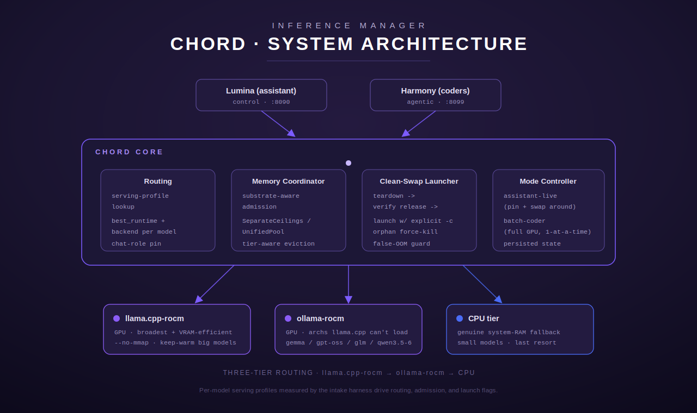

# Chord — Architecture

A component deep-dive, written from the source in [`../src/`](../src). Every
component below names the real module, type, or function that backs it. Where the
[architecture diagram](../assets/architecture.svg) shows a box whose logic is
spread across several modules (or whose spec'd shape differs from what shipped in
this extracted crate), that is called out explicitly rather than papered over.

## What Chord is

Chord (`chord-proxy`) is the inference manager that fronts a fleet of local LLM
backends. A single process exposes **two axum listeners** built in
[`main.rs`](../src/main.rs):

- the **proxy port** (`CHORD_PROXY_PORT`, default `9099`) — the request front
  door, router built by [`routes::build_router`](../src/routes.rs);
- the **control port** (`CHORD_CONTROL_PORT`, default `8090`) — the operator /
  dashboard API, router built by
  [`control::build_control_router`](../src/control.rs). A bind failure on the
  control port is logged but never takes the proxy down (`main.rs` spawns it in a
  task that only warns on error).

Shared state is the single `AppState` struct ([`routes.rs`](../src/routes.rs)),
which carries the MCP proxy, the agentic executor, the rate limiter, the model
registry, the pull coordinator, the local evictor, and the disk probe/lock — so
the proxy handlers and the control handlers operate over the same live registry.

## Request flow (the proxy front door)

The OpenAI-compatible entry point is
[`routes::chat_completions`](../src/routes.rs) (`POST /v1/chat/completions`). In
order, a request goes through:

1. **Auth** — `auth_check` validates the JWT (`Authorization: Bearer …`) against
   `CHORD_JWT_SECRET`. An empty secret disables auth cluster-wide (used in tests
   and trusted single-tenant deploys). Auth failures are recorded by the
   `AuditLogger` (token hashed, never stored).
2. **Backend-configured check** — if `CHORD_LLM_URL` is unset the endpoint returns
   `503` immediately.
3. **Rate limit** — `ProxyRateLimiter::check_and_record` applies the per-user
   daily LLM budget; over-budget returns `429` with `Retry-After`.
4. **Alias resolution** — `config::resolve_model_alias` rewrites the request's
   `model` (e.g. a `lumina-fast` alias → the real `gpt-oss:20b`) so the upstream
   never sees a name it doesn't know. The model name is normalized to a tagged
   `name:tag` registry key (untagged ⇒ `:latest`).
5. **Pull-on-miss (storage tier)** — the resolved model's tier is looked up in the
   registry; **only** a `Cold` model triggers a transparent archive pull
   (`PullCoordinator::ensure_local`) before inference. Hot / Warm / registry-unknown
   models pass straight through. Any known model has its `last_requested` bumped.
6. **Backend routing** — `models::routing::resolve_and_ensure` picks the model's
   tagged backend, starts it on demand if needed, and returns the upstream URL.
   On any failure it falls back to `CHORD_LLM_URL` ("availability over strictness").
7. **Thinking-mode honoring (YARN-06)** — an optional top-level `"thinking":
   "on"` / `"thinking": "off"` field on the incoming request is Chord's own
   per-request contract field for a caller (e.g. Harmony) that wants to force
   reasoning-trace mode for this one call. Chord makes **no decision about
   when to think** — that step-type heuristic is entirely the caller's; Chord
   only resolves whether the hint **can** be honored
   (`serving::profile::resolve_thinking_request`, driven by the target
   model's `serving_profile.env_json.thinking` block — `supports_thinking &&
   validated`, see [serving.md](serving.md)) and, if so, honors it. See
   **"Per-request thinking mode"** below for the full contract (accepted
   values, and what happens when the model doesn't support it, the value is
   absent, or it's malformed).
8. **Forward** — hop-by-hop headers are stripped, the (possibly model- and/or
   thinking-rewritten) body is forwarded, and the upstream response — JSON or
   `text/event-stream` — is streamed straight back to the caller.

#### Per-request thinking mode (`POST /v1/chat/completions`)

An external contract for callers (Harmony's THINK-01/02) that want to request
thinking mode on a single inference call, without Chord making any judgment
about *when* a step should think:

| Request field | Type | Required | Meaning |
|---|---|---|---|
| `thinking` | string, `"on"` or `"off"` (case-insensitive) | No | Force reasoning-trace mode on/off for this one request. |

Behavior:

- **Absent** — the model's own default mode is used, unchanged. This is the
  legacy behavior (no regression) and applies whenever the field is omitted.
- **`"on"` / `"off"` on a model that supports thinking AND whose thinking
  config is validated** — honored. Chord sets/merges
  `chat_template_kwargs.enable_thinking` (`true`/`false`) into the body
  forwarded to the backend. This is the actual runtime mechanism: llama.cpp's
  `llama-server` (and vLLM/SGLang, for Qwen3-style chat templates) read
  `chat_template_kwargs.enable_thinking` from **every** request body — an
  already-warm/resident model honors it per-call, no relaunch required.
- **`"on"` / `"off"` on a model that does NOT support thinking, or whose
  thinking config is present but not yet validated** — ignored, **not** an
  error. The model's default mode is served (HTTP 200 as normal); Chord logs
  a debug-level note naming the reason. An unvalidated config is treated
  identically to a wholly non-supporting model — Chord never serves an
  unvalidated/untrusted thinking mode.
- **Any other value** (anything besides `"on"`/`"off"`, case-insensitively) —
  treated as malformed: degrades to the model's default mode with a logged
  warning, never a 4xx/5xx and never a crash.
- In every case, the `thinking` field itself is stripped before the request
  is forwarded upstream — it is Chord's own contract field, not something an
  OpenAI-compatible backend understands.

Query whether a given model supports this ahead of time via `GET
/api/models`'s `supports_thinking` field (below) — a caller can skip sending
`thinking` at all for a model that doesn't support it.

The other proxy routes are `/v1/tools/list`, `/v1/tools/call`,
`/v1/tools/discover` (the MCP tool surface), `/v1/agent/execute` (the agentic
loop, below), `/v1/infer` (one prompt → normalized per-backend metrics), and
`/health` / `/v1/audit/summary` (no auth).

## Components

### Routing

**What it is.** Two distinct routing decisions, in two modules:

- **Backend-per-model (the "how to serve it" decision)** —
  [`models::routing`](../src/models/routing.rs).
  `resolve_and_ensure` maps a registry model to its tagged
  [`Backend`](../src/models/backends.rs), converts it to the
  `terminus_rs` lifecycle shape (`to_resolved`), and calls
  `lifecycle::ensure_up` to start an on-demand backend before forwarding.
  A companion `idle_stop_sweep` (spawned from `main.rs`, 60 s interval) stops any
  on-demand GPU backend whose `idle_stop_secs` has elapsed — "no perpetual holds".
  Always-on, Ollama, and daemon backends are never stopped.

- **Chat-role pin (the "which model is the assistant" decision)** —
  [`routing::assistant_profile`](../src/routing/assistant_profile.rs).
  `decide_chat_role` / `fetch_chat_role_decision` consume the S84 assistant-intake
  measurement (via `terminus_rs::intake::assistant::reporting`) and return a
  `ChatRoleDecision`:
  - `Route { model_id, backend_tag, behavioral_mean }` — point the Lumina chat
    alias at a measured-fit model **that already cleared the intake latency /
    degradation guard**, and
  - `KeepDefault { reason }` — when no candidate cleared the guard, *or* the
    measured pick isn't a registry-known model, keep the operator's current alias.

  This is the "chat-role pin" box on the diagram: it pins interactive traffic to
  an intended, vetted backend and refuses to route the chat alias to a model the
  registry can't actually serve.

### Backend tiers

**What it is.** First-class, hardware-tagged inference backends —
[`models::backends`](../src/models/backends.rs).
The data model is the `Backend` struct (`name`, `url`, `hardware: Hardware`,
`kind: BackendKind`, `always_on`, `idle_stop_secs`, optional `LaunchSpec`).
`Backend::on_demand()` is true for non-`always_on`, non-`Daemon` backends.

`seed_from_env` builds the default catalogue from env, mirroring the three-tier
stack in the README/diagram:

| Backend | `hardware` / `kind` | Tier | Notes |
|---------|---------------------|------|-------|
| `ollama` | `Cpu` / `Ollama` | CPU | primary, `always_on` (ROCm doesn't engage on this APU, so it's the CPU tier) |
| `ollama-cpu` | `Cpu` / `Ollama` | CPU | resident embeddings / micro-jobs |
| `lemonade-coder` | `Gpu` / `LlamaServer` | GPU (llama.cpp) | one fixed model, unit-managed, idle-stops at 900 s |
| `llama-gpu` | `Gpu` / `LlamaServer` | GPU (llama.cpp) | generic on-demand server that loads *any* requested model's blob |

The generic `llama-gpu` `LaunchSpec` is where the diagram's
"**launch w/ explicit `-c`**" and "**`--no-mmap`**" annotations physically live —
its `args` are `-c 32768 -ngl 999 -fa 1 --no-mmap --host 0.0.0.0 --port …` with
the model passed via `-m`. The CPU tier is the genuine system-RAM fallback "last
resort" for small models.

> Note on the diagram's `ollama-rocm` label: in this crate the Ollama backends are
> tagged `Hardware::Cpu` because ROCm does not engage on the target APU. The
> "ollama as a GPU fallback for architectures llama.cpp can't load" story is a
> deployment/topology concern, not a separate code path here — both Ollama
> backends share the same `BackendKind::Ollama` routing.

### Model registry & storage tiering

**What it is.** The persistent record of every known model and which storage tier
it lives at — [`models::registry`](../src/models/registry.rs), type
`ModelRegistry` over `ModelRecord`. The tiers are the `StorageTier` enum:

- `Hot` — loaded in VRAM (or marked loaded);
- `Warm` — present on local disk, not loaded;
- `Cold` — only in the archive (e.g. NFS), must be pulled before use.

The registry is a JSON file (atomic temp-file-then-rename `save()`; corrupt JSON
rebuilds empty rather than panicking). At startup `reconcile()` walks the local
and archive Ollama manifest trees and re-tiers records to match on-disk reality
(including demoting a model whose local copy vanished out-of-band). `register_external`
/ `register_diffusiongemma_from_env` track non-Ollama models (a `llama-diffusion`
daemon model) that `reconcile()` deliberately leaves alone.

`warm_eviction_candidates()` is the LRU candidate set the eviction logic consumes
(warm, non-protected, Ollama-managed only). Protected models — by per-record flag
or the configured `MODEL_PROTECTED` set — are never demoted to `Cold`
(`set_tier` refuses it).

### Memory / residency management

> **Spec mapping.** The diagram labels a "**Memory Coordinator**" box
> ("substrate-aware", "SeparateCeilings", "UnifiedPool", "admission",
> "tier-aware eviction"), a "**Clean-Swap Launcher**" box ("teardown →",
> "verify release →", "orphan force-kill", "false-OOM guard",
> "launch w/ explicit `-c`"), and a "**Mode Controller**" box. As of
> chord-proxy 1.1.0 all three ship in [`src/serving/`](../src/serving) —
> `SeparateCeilings`, `UnifiedPool`, the `VramResidencyManager` coordinator, the
> `clean_swap` barrier with `verify_release` (orphan kill + false-OOM guard), and
> the persisted `ModeController` are all real types. The serving subsystem doc
> ([serving.md](serving.md)) walks through them in detail.

Residency / memory behaviour spans the VRAM serving layer and the storage layer:

- **VRAM Memory Coordinator** — [`serving::residency::VramResidencyManager`](../src/serving/residency.rs)
  owns the resident set, in-flight reservations, the pinned chat model, and the
  operating mode behind one lock. `register_resident` is the admission entry: it
  sizes admissible free VRAM through the active substrate accounting model
  ([`serving::memory_model`](../src/serving/memory_model.rs): `SeparateCeilings`
  for a fixed carveout, `UnifiedPool` for dynamic-GTT), asks
  [`serving::eviction::plan_admission`](../src/serving/eviction.rs) for a
  tier-aware plan (transient → keep-warm LRU; the `Tier::Chat` pin is never
  evicted), claims victims under the lock to avoid a double-eviction race, and
  reclaims their VRAM outside it. Any unreadable counter is fail-safe "won't fit".
- **Clean-Swap Launcher** — [`serving::swap::clean_swap`](../src/serving/swap.rs)
  enforces teardown → verify-release → launch. [`serving::release_verify::verify_release`](../src/serving/release_verify.rs)
  confirms the device returned to `baseline + tolerance`, force-kills an orphaned
  backend, and refuses to launch onto a polluted device (the false-OOM guard).
  Every swap launches with an explicit `-c <n_ctx>`
  ([`serving::launcher`](../src/serving/launcher.rs) builds the command; a missing
  profile ctx is filled by `default_ctx_for_footprint`).
- **Mode Controller** — [`serving::mode::ModeController`](../src/serving/mode.rs)
  with `OperatingMode::{AssistantLive, BatchCoder}`; switching off assistant-live
  requires explicit confirm, and the mode is persisted via
  `residency::read_persisted_mode` so it survives a restart.
- **Tier-aware eviction (storage)** — [`models::eviction`](../src/models/eviction.rs).
  `evict_to_archive` performs an archive-first, verify-then-delete, GC-aware
  warm → cold eviction. `run_eviction_sweep` runs a cooldown pass then a
  disk-pressure pass (LRU above `MODEL_DISK_PRESSURE_PERCENT`); `evict_for_space`
  is the targeted pre-pull variant. A shared `DiskOpLock` serialises destructive
  disk ops. This is the **disk** tier (warm↔cold), distinct from the VRAM ceiling.
- **Archive pull / admission-by-space** — [`models::transfer`](../src/models/transfer.rs).
  `PullCoordinator::ensure_local` is the cold → warm copy with a disk precheck that
  fails fast, per-model dedup locking, timeout, and partial-file cleanup.

See [serving.md](serving.md) for the full module-by-module walkthrough.

### Control API (operator / dashboard surface)

**What it is.** The second listener — [`control`](../src/control.rs),
`build_control_router`. All endpoints require the same JWT as the proxy. It
exposes the registry and tiering controls:

| Method | Path | Purpose |
|--------|------|---------|
| GET | `/api/models` | list every registry record |
| GET | `/api/models/:name` | single model detail (404 unknown) |
| POST | `/api/models/:name/archive` | warm → cold (`evict_to_archive`); Hot → 409, protected → 403 |
| POST | `/api/models/:name/pull` | cold → warm (`ensure_local`); insufficient space → 507 |
| POST | `/api/models/:name/protect` | toggle/set the protected flag |
| GET | `/api/storage` | local + archive disk usage |
| POST | `/api/models/sweep` | trigger an eviction sweep (202 Accepted, runs async) |
| POST | `/api/models/reconcile` | **MSM-04**: reconcile the registry against on-disk reality and persist it; returns before/after `{hot,warm,cold}` tier counts (200, synchronous) |
| POST | `/api/storage/gc` | **MSM-04**: run the MSM-03 orphan-blob GC pass; returns `{orphans_deleted, freed_bytes, errors}` (200, synchronous) |
| GET | `/health` | version metadata (no auth) |

**MSM-01..06 (S111): anti-drift + crash-safety hardening.** A 2026-07-10
incident (`MODEL_ARCHIVE_PATH` unset after a redeploy silently disabling all
eviction, a stalled NFS write wedging the in-process sweep, a stale on-disk
registry, and `MODEL_PROTECTED` losing effect on a registry rebuild) motivated:
- **MSM-01**: `reconcile()` now runs at the start of every background sweep
  tick (not just startup), and the registry is persisted atomically
  (`ModelRegistry::save`, temp-file + rename) after every reconcile and every
  eviction — the on-disk `model-registry.json` never lags in-memory by more
  than one sweep interval. Persist failures are non-fatal (warn + continue).
- **MSM-02**: the warm→cold eviction copy (`eviction::evict_to_archive`) is now
  wrapped in a `tokio::time::timeout` (`MODEL_ARCHIVE_COPY_TIMEOUT_SECS`,
  default 1800s), mirroring TIER-02's pull-side timeout. On timeout or a
  mid-copy I/O error, any archive files that specific attempt wrote are
  cleaned up (never a pre-existing/shared archive blob), the model stays Warm
  for retry on the next sweep, and the shared disk-op lock is always released
  — a stalled NFS write can no longer wedge the sweep indefinitely.
- **MSM-03**: a new orphan-blob GC pass (`models::gc::run_gc`) finds local
  blobs referenced by no local manifest (an interrupted eviction can leave
  these behind) and safely deletes them when a cold copy exists in the
  archive, or when they're truly unreferenced anywhere (no local manifest, no
  archive manifest, no archive blob file). A blob referenced by any local
  manifest, or one an archive manifest expects but whose archive blob file is
  missing, is never deleted. Runs as part of the background sweep, after
  eviction, and via `POST /api/storage/gc`.
- **MSM-05**: `MODEL_PROTECTED` is now authoritative and re-applied on every
  reconcile (not just unioned into records the local/archive scans happen to
  touch), so a registry rebuild/loss can never silently unprotect a
  configured-protected model.
- **MSM-06**: [`deploy/model-storage-manager/`](../deploy/model-storage-manager/)
  — an external systemd service + timer that drives
  reconcile → sweep → gc every ~15 min via the control API, entirely
  out-of-process (so it can never be wedged by Chord's own disk-op lock),
  with a JSON heartbeat and alerting on failure or an unrelieved high-water
  disk condition.

`GET /api/models` / `GET /api/models/:name` response fields (per model,
`ModelView` in [`control.rs`](../src/control.rs)) include a **YARN-06**
capability-advertisement field:

| Field | Type | Meaning |
|---|---|---|
| `supports_thinking` | bool | Whether this model currently supports the `thinking` request parameter on `/v1/chat/completions` (see "Per-request thinking mode" above). `true` only when the model's serving profile has a `thinking` block AND `supports_thinking` AND `validated` are all true in it — an unvalidated config is never advertised as available. Computed fresh on every request from the in-process `serving::profile::RoutingMap` (never independently cached), so the value always matches what `/v1/chat/completions` would honor from that same map right now — **but** the map itself is loaded once at process startup from the intake DB and is not hot-reloaded, so a model reprofiled (or newly validated) after Chord starts is not reflected until the next process restart (see [serving.md](serving.md)). |

### Agentic loop

**What it is.** A guarded LLM↔tool execution loop —
[`agentic`](../src/agentic), entry type `AgenticExecutor`
([`loop_runner.rs`](../src/agentic/loop_runner.rs)), reached via
`POST /v1/agent/execute`. It runs the model↔tool loop up to `max_tool_calls`
iterations and returns an `AgenticResponse` whose execution log is **metadata
only** — tool arguments and raw results never cross the wire.

Five security guards run at every step (each emits a `SecurityEvent`):

- `PermissionEnforcer` ([permissions.rs](../src/agentic/permissions.rs)) — per-user
  allowed-tool sets;
- `ArgumentGuard` ([argument_guard.rs](../src/agentic/argument_guard.rs)) — blocks
  shell / SQL injection and credential patterns in tool arguments;
- `ResultGuard` ([result_guard.rs](../src/agentic/result_guard.rs)) — sanitizes
  suspicious tool results;
- `ResponseGuard` ([response_guard.rs](../src/agentic/response_guard.rs)) — detects
  cross-step injection chains;
- `BehavioralMonitor` ([behavioral_monitor.rs](../src/agentic/behavioral_monitor.rs))
  — flags internal-data → external-tool exfiltration patterns.

Within the loop, `AgenticModelRouter`
([model_router.rs](../src/agentic/model_router.rs)) escalates **once** from the
fast model (`CHORD_FAST_MODEL`) to the deep model (`CHORD_DEEP_MODEL`) when a
complexity heuristic fires (tool-result count, total chars, or reasoning
keywords) — capped at one escalation per execution so VRAM isn't thrashed.
Progress is streamed as SSE `ProgressEvent`s
([streaming.rs](../src/agentic/streaming.rs)) when the caller sets `stream: true`.

### Search harness (Harness-1)

**What it is.** A stateful research state machine inside the agentic executor —
[`harness`](../src/harness), type `SearchHarness` over a `WorkingMemory`
(candidate pool, curated set, evidence graph, verification records). The harness
holds the bookkeeping; the model emits one `HarnessAction` per turn and the
harness renders a compact observation back. A `SearchBudget` caps turns.

The `ResearchDetector` ([detector.rs](../src/harness/detector.rs)) decides whether
a query warrants the full harness (explicit `/research` command, intent keywords,
or a complexity score above `HARNESS_TRIGGER_THRESHOLD`) versus a plain search.
When it fires, `harness_integration` rotates VRAM via `HarnessVramManager` through
the sequence `personality → search-model → synthesis → personality`, then builds a
citation-style `SynthesisPrompt` from the curated documents. Every VRAM-rotation
failure degrades gracefully (`SwapOutcome::Fallback` / `Degraded`) — never a crash.

## Observability (SNAP)

Chord 1.2.0 folds in the "SNAP" observability features (previously a separate
harmony-chord codebase) as an additive subsystem under
[`src/snap/`](../src/snap/). It contributes a read-only telemetry surface on the
existing control port, gated by the same JWT auth as `/api/models`, with no
change to the request path:

- **VRAM reader** ([`snap::vram`](../src/snap/vram.rs), SNAP-02) — the *actual*
  GPU read from sysfs (`mem_info_vram_total`) with a `rocm-smi --json` fallback
  and an Ollama-allocation roll-up. This complements `serving::memory_model`
  (which is VRAM *accounting*); the reader is the missing device-truth source.
- **Health monitor** ([`snap::health`](../src/snap/health.rs)) — a background
  poller that fills a shared `InferenceState` (engines + per-model load) every
  `SNAP_POLL_INTERVAL_SECS`; only env-configured endpoints are polled.
- **Model inventory** ([`snap::inventory`](../src/snap/inventory.rs), SNAP-03) —
  scans `SNAP_STORAGE_LOCATIONS` for GGUF files (with quant detection) and
  Ollama manifests, reporting size, tier, and cleanup candidates.
- **Activity tracker** ([`snap::activity`](../src/snap/activity.rs), SNAP-04) —
  passive per-engine/per-model in-use observation derived from live state.
- **Analytics** ([`snap::analytics`](../src/snap/analytics.rs), SNAP-05) —
  `RequestLogger`: append-only JSONL request log with imputed cloud-cost and
  savings summaries vs. representative cloud pricing.
- **vLLM adapter** ([`snap::vllm`](../src/snap/vllm.rs), VLLM-01) — a vLLM
  `EngineAdapter` backend option (gfx1151 container lifecycle), additive to the
  existing `serving/` launch path.

Endpoints (all `GET`, control port, JWT-gated): `/api/vram`, `/api/activity`,
`/api/inventory`, `/api/analytics/requests`, `/api/analytics/cost`,
`/api/analytics/savings`. Harmony-chord's mutating lifecycle/config endpoints and
its streaming reverse proxy were intentionally **not** ported — chord already
owns the proxy path (`routes.rs` / `mcp_proxy.rs` / `routing/`), so only the
unique analytics/inventory/observation *value* was reconciled in.

Env knobs: `SNAP_POLL_INTERVAL_SECS`, `SNAP_DATA_DIR` (falls back to
`CHORD_DATA_DIR` then the system temp dir), `SNAP_STORAGE_LOCATIONS`
(`name:tier:/path` entries separated by `;`), `LLAMA_SERVER_URL`, `OLLAMA_URL`,
`OLLAMA_CPU_URL`, `CHORD_VLLM_URL`.

## Configuration surface

All operational knobs come from env (parsed in [`config.rs`](../src/config.rs)) —
nothing infrastructure-specific is hardcoded. Key variables: `CHORD_PROXY_PORT`,
`CHORD_CONTROL_PORT`, `CHORD_JWT_SECRET`, `CHORD_LLM_URL`, `CHORD_MODEL_ALIASES`,
`MODEL_LOCAL_PATH` / `MODEL_ARCHIVE_PATH` / `MODEL_REGISTRY_PATH`,
`MODEL_PROTECTED`, `MODEL_DISK_PRESSURE_PERCENT`, `MODEL_WARM_COOLDOWN_HOURS`,
`CHORD_FAST_MODEL` / `CHORD_DEEP_MODEL`, the `HARNESS_*` harness knobs, and the
`SNAP_*` observability knobs (see Observability above).
