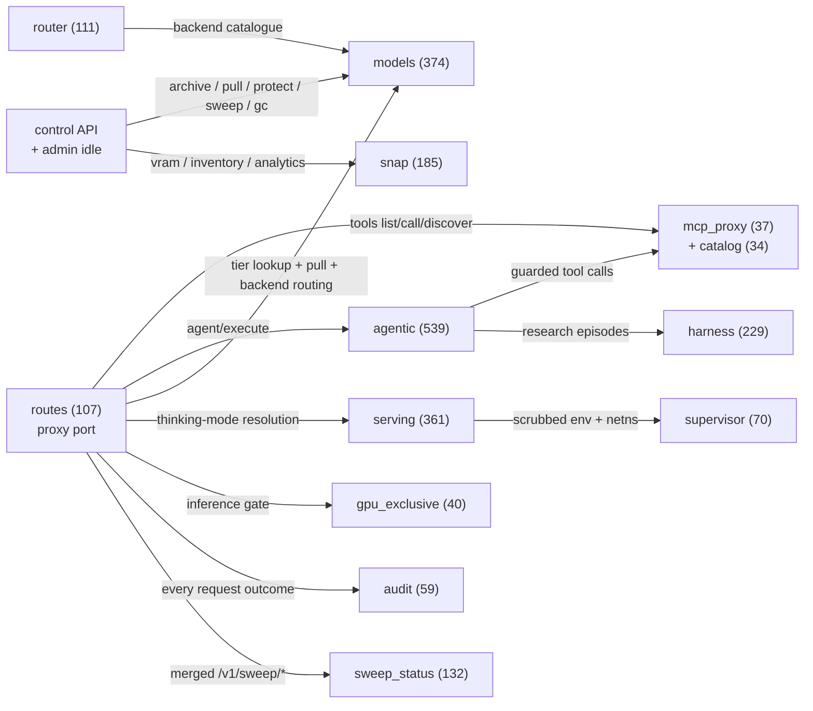

# Chord — Architecture

A component deep-dive, written from the source in [`../src/`](../src). Every
component below names the real module, type, or function that backs it. Where the
[architecture diagram](../assets/architecture.svg) shows a box whose logic is
spread across several modules (or whose spec'd shape differs from what shipped in
this extracted crate), that is called out explicitly rather than papered over.

## What Chord is

Chord (`chord-proxy`) is the inference manager that fronts a fleet of local LLM
backends. A single process exposes **two axum listeners** built in
[`main.rs`](../src/main.rs):

- the **proxy port** (`CHORD_PROXY_PORT`, default `9099`) — the request front
  door, router built by [`routes::build_router`](../src/routes.rs);
- the **control port** (`CHORD_CONTROL_PORT`, default `8090`) — the operator /
  dashboard API, router built by
  [`control::build_control_router`](../src/control.rs). A bind failure on the
  control port is logged but never takes the proxy down (`main.rs` spawns it in a
  task that only warns on error).

Shared state is the single `AppState` struct ([`routes.rs`](../src/routes.rs)),
which carries the MCP proxy, the agentic executor, the rate limiter, the model
registry, the pull coordinator, the local evictor, and the disk probe/lock — so
the proxy handlers and the control handlers operate over the same live registry.

## Subsystem map (derived from the code knowledge graph)

The KG for this repo has 3,182 nodes and 7,892 intra-repo edges, rolled up into
17 subsystems with 114 cross-subsystem call edges. The picture that falls out
(node labels carry real symbol counts):

Background tasks spawned by `main.rs` tie the rest together: the eviction sweep
(`models::eviction::run_eviction_sweep` + `models::gc::run_gc`), the backend
idle-stop sweep (`models::routing::idle_stop_sweep`), the DiffusionGemma idle
reaper (`diffusion::spawn_idle_reaper`), the SNAP health monitor
(`snap::spawn_health_monitor`), the sweep-status poller
(`sweep_status::poll::spawn`), and the idle-mode watchdog
(`admin::idle::watchdog_loop`).

## Request flow (the proxy front door)

The OpenAI-compatible entry point is
[`routes::chat_completions`](../src/routes.rs) (`POST /v1/chat/completions`). In
order, a request goes through:

1. **Auth** — `auth_check` validates the JWT (`Authorization: Bearer …`) against
   `CHORD_JWT_SECRET`. An empty secret disables auth cluster-wide (used in tests
   and trusted single-tenant deploys). Auth failures are recorded by the
   `AuditLogger` (token hashed, never stored).
2. **GPU-exclusive gate** — if an external job holds the GPU lock
   (`gpu_exclusive::GpuExclusive::active_holder`), the inference paths return a
   structured `503` naming the holder rather than racing the GPU (see
   "GPU-exclusive coordination" below).
3. **Backend-configured check** — if `CHORD_LLM_URL` is unset the endpoint returns
   `503` immediately.
4. **Rate limit** — `ProxyRateLimiter::check_and_record` applies the per-user
   daily LLM budget; over-budget returns `429` with `Retry-After`.
5. **Alias resolution** — `config::resolve_model_alias` rewrites the request's
   `model` (e.g. a `lumina-fast` alias → the real `gpt-oss:20b`) so the upstream
   never sees a name it doesn't know. The model name is normalized to a tagged
   `name:tag` registry key (untagged ⇒ `:latest`).
6. **Pull-on-miss (storage tier)** — the resolved model's tier is looked up in the
   registry; **only** a `Cold` model triggers a transparent archive pull
   (`PullCoordinator::ensure_local`) before inference. Hot / Warm / registry-unknown
   models pass straight through. Any known model has its `last_requested` bumped.
7. **Backend routing** — `models::routing::resolve_and_ensure` picks the model's
   tagged backend, starts it on demand if needed, and returns the upstream URL.
   On any failure it falls back to `CHORD_LLM_URL` ("availability over strictness").
8. **Thinking-mode honoring (YARN-06)** — an optional top-level `"thinking":
   "on"` / `"thinking": "off"` field on the incoming request is Chord's own
   per-request contract field for a caller (e.g. Harmony) that wants to force
   reasoning-trace mode for this one call. Chord makes **no decision about
   when to think** — that step-type heuristic is entirely the caller's; Chord
   only resolves whether the hint **can** be honored
   (`serving::profile::resolve_thinking_request`, driven by the target
   model's `serving_profile.env_json.thinking` block — `supports_thinking &&
   validated`, see [serving.md](serving.md)) and, if so, honors it. See
   **"Per-request thinking mode"** below for the full contract.
9. **Forward** — hop-by-hop headers are stripped, the (possibly model- and/or
   thinking-rewritten) body is forwarded, and the upstream response — JSON or
   `text/event-stream` — is streamed straight back to the caller.

#### Per-request thinking mode (`POST /v1/chat/completions`)

An external contract for callers (Harmony's THINK-01/02) that want to request
thinking mode on a single inference call, without Chord making any judgment
about *when* a step should think:

| Request field | Type | Required | Meaning |
|---|---|---|---|
| `thinking` | string, `"on"` or `"off"` (case-insensitive) | No | Force reasoning-trace mode on/off for this one request. |

Behavior:

- **Absent** — the model's own default mode is used, unchanged (no regression).
- **`"on"` / `"off"` on a model that supports thinking AND whose thinking
  config is validated** — honored. Chord sets/merges
  `chat_template_kwargs.enable_thinking` (`true`/`false`) into the body
  forwarded to the backend. This is the actual runtime mechanism: llama.cpp's
  `llama-server` (and vLLM/SGLang, for Qwen3-style chat templates) read
  `chat_template_kwargs.enable_thinking` from **every** request body — an
  already-warm/resident model honors it per-call, no relaunch required.
- **`"on"` / `"off"` on a model that does NOT support thinking, or whose
  thinking config is present but not yet validated** — ignored, **not** an
  error; the model's default mode is served (HTTP 200) with a debug-level log.
  An unvalidated config is treated identically to a non-supporting model.
- **Any other value** — treated as malformed: degrades to the model's default
  mode with a logged warning, never a 4xx/5xx and never a crash.
- In every case, the `thinking` field itself is stripped before the request
  is forwarded upstream.

Query whether a given model supports this ahead of time via `GET
/api/models`'s `supports_thinking` field (below).

The other proxy routes are `/v1/tools/list`, `/v1/tools/call`,
`/v1/tools/discover` (the MCP tool surface), `/v1/personal/tools/list` /
`/v1/personal/tools/call` (the optional federated personal-tool catalog),
`/v1/agent/execute` (the agentic loop), `/v1/embeddings` (local-first embeddings
proxy), `/v1/infer` (one prompt → normalized per-backend metrics),
`/v1/coding/select` (coding-model resolution), `/v1/gpu-exclusive/*`,
`/v1/sweep/status[/history]`, and `/health` / `/v1/audit/summary` (no auth). The
full table lives in [reference/routes.md](reference/routes.md).

## Components

### Routing

**What it is.** Two distinct routing decisions, in two modules:

- **Backend-per-model (the "how to serve it" decision)** —
  [`models::routing`](../src/models/routing.rs).
  `resolve_and_ensure` maps a registry model to its tagged
  [`Backend`](../src/models/backends.rs), converts it to the
  `terminus_rs` lifecycle shape (`to_resolved`), and calls
  `lifecycle::ensure_up` to start an on-demand backend before forwarding.
  A companion `idle_stop_sweep` (spawned from `main.rs`, 60 s interval) stops any
  on-demand GPU backend whose `idle_stop_secs` has elapsed — "no perpetual holds".
  Always-on, Ollama, and daemon backends are never stopped.

- **Chat-role pin (the "which model is the assistant" decision)** —
  [`routing::assistant_profile`](../src/routing/assistant_profile.rs).
  `decide_chat_role` / `fetch_chat_role_decision` consume the S84 assistant-intake
  measurement (via `terminus_rs::intake::assistant::reporting`) and return a
  `ChatRoleDecision`:
  - `Route { model_id, backend_tag, behavioral_mean }` — point the Lumina chat
    alias at a measured-fit model **that already cleared the intake latency /
    degradation guard**, and
  - `KeepDefault { reason }` — when no candidate cleared the guard, *or* the
    measured pick isn't a registry-known model, keep the operator's current alias.

### Backend tiers

**What it is.** First-class, hardware-tagged inference backends —
[`models::backends`](../src/models/backends.rs).
The data model is the `Backend` struct (`name`, `url`, `hardware: Hardware`,
`kind: BackendKind`, `always_on`, `idle_stop_secs`, optional `LaunchSpec`).
`Backend::on_demand()` is true for non-`always_on`, non-`Daemon` backends.
`seed_from_env` builds the default catalogue from env: an always-on Ollama CPU
tier (plus a second resident Ollama for embeddings / micro-jobs), a
unit-managed llama.cpp GPU server for one fixed coder model, and a generic
on-demand `llama-gpu` llama.cpp server that loads any requested model's blob
(its `LaunchSpec` carries the explicit `-c` context size and `--no-mmap`). The
CPU tier is the genuine system-RAM "last resort" for small models.

> Note: in this crate the Ollama backends are tagged `Hardware::Cpu` because
> ROCm does not engage on the target APU. "Ollama as a GPU fallback for
> architectures llama.cpp can't load" is a deployment/topology concern, not a
> separate code path here.

### Model registry & storage tiering

**What it is.** The persistent record of every known model and which storage tier
it lives at — [`models::registry`](../src/models/registry.rs), type
`ModelRegistry` over `ModelRecord`. The tiers are the `StorageTier` enum:

- `Hot` — loaded in VRAM (or marked loaded);
- `Warm` — present on local disk, not loaded;
- `Cold` — only in the archive (e.g. NFS), must be pulled before use.

The registry is a JSON file (atomic temp-file-then-rename `save()`; corrupt JSON
rebuilds empty rather than panicking). At startup `reconcile()` walks the local
and archive Ollama manifest trees and re-tiers records to match on-disk reality
(including demoting a model whose local copy vanished out-of-band).
`register_external` / `register_diffusiongemma_from_env` /
`register_openrouter_owl_alpha_from_env` track non-Ollama models that
`reconcile()` deliberately leaves alone.

`warm_eviction_candidates()` is the LRU candidate set the eviction logic consumes
(warm, non-protected, Ollama-managed only). Protected models — by per-record flag
or the configured `MODEL_PROTECTED` set — are never demoted to `Cold`
(`set_tier` refuses it).

### Memory / residency management

Residency / memory behaviour spans the VRAM serving layer and the storage layer
(all in [`src/serving/`](../src/serving) and [`src/models/`](../src/models)):

- **VRAM Memory Coordinator** — [`serving::residency::VramResidencyManager`](../src/serving/residency.rs)
  owns the resident set, in-flight reservations, the pinned chat model, and the
  operating mode behind one lock. `register_resident` is the admission entry: it
  sizes admissible free VRAM through the active substrate accounting model
  ([`serving::memory_model`](../src/serving/memory_model.rs): `SeparateCeilings`
  for a fixed carveout, `UnifiedPool` for dynamic-GTT), asks
  [`serving::eviction::plan_admission`](../src/serving/eviction.rs) for a
  tier-aware plan (transient → keep-warm LRU; the `Tier::Chat` pin is never
  evicted), claims victims under the lock to avoid a double-eviction race, and
  reclaims their VRAM outside it. Any unreadable counter is fail-safe "won't fit".
- **Clean-Swap Launcher** — [`serving::swap::clean_swap`](../src/serving/swap.rs)
  enforces teardown → verify-release → launch. [`serving::release_verify::verify_release`](../src/serving/release_verify.rs)
  confirms the device returned to `baseline + tolerance`, force-kills an orphaned
  backend, and refuses to launch onto a polluted device (the false-OOM guard).
  Every swap launches with an explicit `-c <n_ctx>`
  ([`serving::launcher`](../src/serving/launcher.rs) builds the command; a missing
  profile ctx is filled by `default_ctx_for_footprint`).
- **Mode Controller** — [`serving::mode::ModeController`](../src/serving/mode.rs)
  with `OperatingMode::{AssistantLive, BatchCoder}`; switching off assistant-live
  requires explicit confirm, and the mode is persisted via
  `residency::read_persisted_mode` so it survives a restart.
- **Tier-aware eviction (storage)** — [`models::eviction`](../src/models/eviction.rs).
  `evict_to_archive` performs an archive-first, verify-then-delete, GC-aware
  warm → cold eviction. `run_eviction_sweep` runs a cooldown pass then a
  disk-pressure pass (LRU above `MODEL_DISK_PRESSURE_PERCENT`); `evict_for_space`
  is the targeted pre-pull variant. A shared `DiskOpLock` serialises destructive
  disk ops. This is the **disk** tier (warm↔cold), distinct from the VRAM ceiling.
- **Archive pull / admission-by-space** — [`models::transfer`](../src/models/transfer.rs).
  `PullCoordinator::ensure_local` is the cold → warm copy with a disk precheck that
  fails fast, per-model dedup locking, timeout, and partial-file cleanup.
- **Anti-drift + crash-safety (MSM-01..06, S111)** — `reconcile()` re-runs at the
  start of every sweep tick with atomic persists; the eviction copy is wrapped in
  `MODEL_ARCHIVE_COPY_TIMEOUT_SECS` so a stalled NFS write can't wedge the sweep;
  `models::gc::run_gc` deletes orphaned blobs only when provably safe;
  `MODEL_PROTECTED` is authoritative on every reconcile; and
  [`deploy/model-storage-manager/`](../deploy/model-storage-manager/) drives
  reconcile → sweep → gc out-of-process on a timer, with heartbeat + alerting.

See [serving.md](serving.md) for the full module-by-module walkthrough and
[reference/models.md](reference/models.md) / [reference/serving.md](reference/serving.md)
for symbol tables.

### Runtime launch isolation (supervisor)

**What it is.** The *posture* of every runtime launch —
[`supervisor`](../src/supervisor/mod.rs). ISO-01 is advisory: `build_runtime_env`
([`launch_env.rs`](../src/supervisor/launch_env.rs)) spawns runtimes with a
scrubbed environment and telemetry-off / offline opt-outs, and
[`egress_policy`](../src/supervisor/egress_policy.rs) declares each launch's
`EgressPosture`. ISO-02 is the kernel guarantee: [`netns`](../src/supervisor/netns.rs)
gives a `Serve`/`Denied` runtime a network namespace with **no route** (every
external `connect()` fails at the kernel), while a `Pull`/`AllowList` runtime gets
a constrained, nftables-filtered path ([`egress_filter`](../src/supervisor/egress_filter.rs))
to the configured model sources only. **Fail-closed**: without `CAP_NET_ADMIN`
the launch is refused, not run with full host egress (`CHORD_ALLOW_UNISOLATED=1`
is the loud, off-by-default override). The serving launcher consumes both; the
clean swap tears namespaces down. Honest scope: this isolates the runtimes Chord
*launches* — it does not firewall Chord's own process. See [egress.md](egress.md).

### GPU-exclusive coordination

**What it is.** A process-global lock ([`gpu_exclusive`](../src/gpu_exclusive.rs),
`GpuExclusive`) that hands the single host GPU to an external GPU-heavy job (the
Terminus intake benchmarking harness) **without taking Chord down** — the fix for
the era when the harness ran `systemctl stop chord.service` and left the fleet
backbone dead for days. `acquire` grants or heartbeat-refreshes a TTL'd lock
(different live holder ⇒ 409); `active_holder` is the gate the inference handlers
consult (`Some` ⇒ structured 503); `release`/expiry restores normal service.
Endpoints: `POST /v1/gpu-exclusive/acquire|release`, `GET /v1/gpu-exclusive/status`.
Everything else — health checks, routing decisions, read-only tools — keeps serving.

### Idle mode + activity signal (admin)

**What it is.** [`admin::idle`](../src/admin/idle.rs) (BLD-09): `POST /admin/idle`
drains and releases providers/GPU/models/RAM so a heavy build (the fleet
compiler) can own the host, `POST /admin/activate` restores, `GET /admin/idle`
reports phase. A watchdog (`watchdog_loop`, spawned in `main.rs`) auto-activates
if the proxy is left idle past a deadline with no live compiler lease — Chord is
never left silently dead. Distinct from the mode: `GET /admin/activity`
(CHORD-ACT-01) reports whether inference is *actually in flight* and how long
Chord has been quiet, so a scheduler can dispatch heavy work into genuine idle
windows.

### Agentic loop

**What it is.** A guarded LLM↔tool execution loop —
[`agentic`](../src/agentic), entry type `AgenticExecutor`
([`loop_runner.rs`](../src/agentic/loop_runner.rs)), reached via
`POST /v1/agent/execute`. It runs the model↔tool loop up to `max_tool_calls`
iterations and returns an `AgenticResponse` whose execution log is **metadata
only** — tool arguments and raw results never cross the wire.

Five security guards run at every step (each emits a `SecurityEvent`):
`PermissionEnforcer` (per-user allowed-tool sets), `ArgumentGuard` (shell/SQL
injection + credential patterns in arguments), `ResultGuard` (sanitizes
suspicious results), `ResponseGuard` (cross-step injection chains), and
`BehavioralMonitor` (internal-data → external-tool exfiltration patterns).
Within the loop, `AgenticModelRouter` ([model_router.rs](../src/agentic/model_router.rs))
escalates **once** from `CHORD_FAST_MODEL` to `CHORD_DEEP_MODEL` when a
complexity heuristic fires — capped at one escalation per execution so VRAM
isn't thrashed. Progress streams as SSE `ProgressEvent`s
([streaming.rs](../src/agentic/streaming.rs)) when the caller sets `stream: true`.

### Search harness (Harness-1)

**What it is.** A stateful research state machine inside the agentic executor —
[`harness`](../src/harness), type `SearchHarness` over a `WorkingMemory`
(candidate pool, curated set, evidence graph, verification records). The harness
holds the bookkeeping; the model emits one `HarnessAction` per turn and the
harness renders a compact observation back. A `SearchBudget` caps turns.
The `ResearchDetector` ([detector.rs](../src/harness/detector.rs)) decides whether
a query warrants the full harness versus a plain search. When it fires,
`harness_integration` rotates VRAM via `HarnessVramManager`
([vram_lifecycle.rs](../src/harness/vram_lifecycle.rs)) through
`personality → search-model → synthesis → personality`, then builds a
citation-style `SynthesisPrompt` from the curated documents. Every VRAM-rotation
failure degrades gracefully (`SwapOutcome::Fallback` / `Degraded`) — never a crash.

### SLM router (documentation-engine inference)

**What it is.** [`router`](../src/router/mod.rs) (DOCGEN-03/04):
`slm_router::SlmRouter::route_and_execute` takes a generation request from the
Terminus documentation engine and decides the destination — local high-context,
local cheap, or the frontier-free OpenRouter tier — per an explicit
`policy::RoutingPolicy` (env-driven), then executes on the chosen destination
with graceful, never-silent fallback. It reuses the existing substrate:
destinations resolve to real `models::backends::Backend`s from `seed_from_env`.
[`eval`](../src/router/eval.rs)/[`eval_storage`](../src/router/eval_storage.rs)
score candidate routers on ROUTING quality (decision appropriateness, doc
quality, cost, latency), persisted to Postgres for cross-run comparison.

### Coding-model selection

**What it is.** `POST /v1/coding/select` ([`coding_proxy.rs`](../src/coding_proxy.rs),
CPROX-03/04): a caller sends a `WorkTypeCode` ("I need CODE work of this shape")
instead of a hardcoded model alias; Chord ranks the real coder-sweep fleet data
([`models::coding_selector`](../src/models/coding_selector.rs)), health-checks the
top candidate, and falls back down the ranked list. Deliberately a **resolution**
(`model_id`/`backend`/`confidence`), not a transparent proxy — the caller then
dispatches against `/v1/chat/completions` itself, so inference budget is consumed
exactly once. Fail-open: no intake DB ⇒ a clear 503, never a startup block.
See [coding-proxy.md](coding-proxy.md).

### Embeddings

**What it is.** `POST /v1/embeddings` ([`embeddings.rs`](../src/embeddings.rs),
EMBED-01): OpenAI-compatible, local-first from the fleet Ollama
(Qwen3-Embedding), falling back to OpenRouter (same model family) on
unreachable/error/timeout/wrong-dimension — a caller can never tell from vector
shape which path served it, and Chord never returns a vector whose length
doesn't match `EMBED_DIM`.

### Managed DiffusionGemma daemon

**What it is.** [`diffusion.rs`](../src/diffusion.rs) (CHRD-DIFF-01): Chord owns
the `llama-diffusion-daemon` lifecycle — lazy start on the first
diffusion-tagged chat request (`DiffusionManager::ensure_running`), idle
eviction by a background reaper after `DIFFUSION_IDLE_SECS` — so the diffusion
model never sits in VRAM perpetually. See
[diffusion-gemma-managed.md](diffusion-gemma-managed.md).

### MCP tool surface + federation

**What it is.** [`mcp_proxy.rs`](../src/mcp_proxy.rs) routes `/v1/tools/*`
between callers and the MCP backend (`MCP_BACKEND_URL`), falling back to the
in-process `terminus-rs` Rust tool registry ([`fallback.rs`](../src/fallback.rs))
when the backend is unavailable. [`catalog.rs`](../src/catalog.rs) merges both
sources (MCP wins name conflicts; cached `CHORD_CATALOG_CACHE_SECS`), and
[`tool_allowlist.rs`](../src/tool_allowlist.rs) scopes what Chord will surface
or execute at all. An optional second, **unfiltered** proxy federates a personal
tool backend (`PERSONAL_BACKEND_URL`) under `/v1/personal/tools/*` — never
merged into the default catalog. Details:
[reference/mcp_proxy.md](reference/mcp_proxy.md).

### Secrets bootstrap

**What it is.** [`secrets_bootstrap.rs`](../src/secrets_bootstrap.rs) + the
[`chord-secrets`](../crates/chord-secrets/src/lib.rs) crate (CSEC-01/02): at
startup, before `Config::from_env`, Chord fetches `CHORD_JWT_SECRET` /
`CHORD_API_KEY` fresh from <secret-manager> via its own Universal Auth identity
(deliberately **not** brokered over internal HTTP hops that aren't
TLS-terminated) and applies them to the process env. Never a hard startup
failure — falls back to the static environment.

### Audit

**What it is.** [`audit.rs`](../src/audit.rs): one JSONL metadata record per
request under `CHORD_AUDIT_PATH` — request type, outcome, duration, hashed
identity. Tool arguments, LLM messages, and memory content are **never** logged.
Size-based rotation at 100 MiB, 10 files retained. `GET /v1/audit/summary`
serves aggregates.

## Observability (SNAP + sweep status)

Chord folds in the "SNAP" observability features as an additive subsystem under
[`src/snap/`](../src/snap/): a read-only telemetry surface on the control port,
gated by the same JWT auth, with no change to the request path:

- **VRAM reader** ([`snap::vram`](../src/snap/vram.rs)) — the *actual* GPU read
  from sysfs with a `rocm-smi --json` fallback and an Ollama-allocation roll-up
  (complements `serving::memory_model`, which is accounting).
- **Health monitor** ([`snap::health`](../src/snap/health.rs)) — background
  poller filling the shared `InferenceState` every `SNAP_POLL_INTERVAL_SECS`.
- **Model inventory** ([`snap::inventory`](../src/snap/inventory.rs)) — scans
  `SNAP_STORAGE_LOCATIONS` for GGUF files (quant detection) and Ollama
  manifests; sizes, tiers, cleanup candidates.
- **Activity tracker** ([`snap::activity`](../src/snap/activity.rs)) — passive
  per-engine/per-model in-use observation.
- **Analytics** ([`snap::analytics`](../src/snap/analytics.rs)) —
  `RequestLogger`: append-only request log + imputed cloud-cost / savings.
- **vLLM adapter** ([`snap::vllm`](../src/snap/vllm.rs)) — vLLM `EngineAdapter`
  backend option (container lifecycle), additive to the `serving/` launch path.

Endpoints (all `GET`, control port, JWT-gated): `/api/vram`, `/api/activity`,
`/api/inventory`, `/api/analytics/requests`, `/api/analytics/cost`,
`/api/analytics/savings`.

[`sweep_status`](../src/sweep_status/mod.rs) is the sibling monitor for the
fleet's model-benchmarking services: a background poller correlates GPU busy
percent, fresh sweep DB rows, Ollama loaded models, and systemd unit state into
a pure `working`/`stuck`/`idle` [`verdict`](../src/sweep_status/verdict.rs) —
built after a real 7-hour silent GPU-wedge jam. Served (no auth, aggregate-only)
at `GET /v1/sweep/status` and `/v1/sweep/status/history` on the proxy port, with
a daily-rotated JSONL log behind it. Every external probe degrades to an
`unavailable` marker — never a crashed poll loop.

## Configuration surface

All operational knobs come from env — nothing infrastructure-specific is
hardcoded, and secret-shaped values are materialized from the vault at runtime.
The surface is 44 keys across [`config.rs`](../src/config.rs) and the
feature-colocated config modules (`snap::config`, `sweep_status::config`,
`embeddings`, `diffusion`, `supervisor::egress_policy`,
`harness::vram_lifecycle`, `models::backends`, `secrets_bootstrap`). Key names
are inventoried per subsystem in the [reference pages](reference/index.md); the
headliners: `CHORD_PROXY_PORT`, `CHORD_CONTROL_PORT`, `CHORD_JWT_SECRET`,
`CHORD_LLM_URL`, `CHORD_MODEL_ALIASES`, `MCP_BACKEND_URL`,
`MODEL_LOCAL_PATH` / `MODEL_ARCHIVE_PATH` / `MODEL_REGISTRY_PATH`,
`MODEL_PROTECTED`, `MODEL_DISK_PRESSURE_PERCENT`, `MODEL_WARM_COOLDOWN_HOURS`,
`CHORD_FAST_MODEL` / `CHORD_DEEP_MODEL`, the `HARNESS_*`, `SNAP_*`,
`CHORD_SWEEP_*`, `EMBED_*`, `DIFFUSION_*`, and `INFISICAL_*` families.
