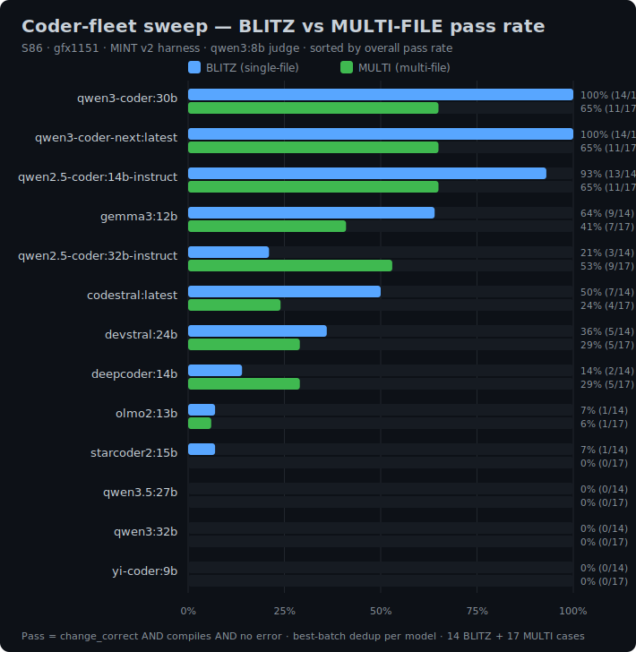
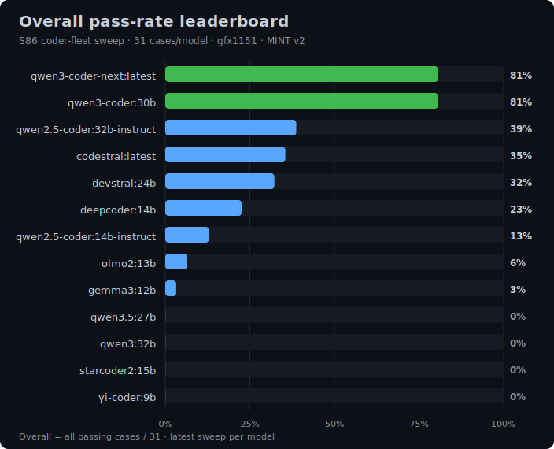

# Test Results — S86 Coder-Fleet Sweep

These are results from the **S86 coder-fleet sweep** run on the `gfx1151` (Radeon 8060S / Strix Halo) serving host, using the **MINT v2 coder harness** with **`qwen3:8b`** as the pass/fail judge. Each model runs a fixed 31-case suite of `build_modify` tasks across Bash, Python, and Rust. Cases split into **BLITZ** (single-file edits, 14 cases) and **MULTI-FILE** (2+ files touched, 17 cases). A case *passes* when the produced change is correct **and** compiles **and** the run recorded no error. Each model ran the suite in one or two distinct hourly batches; results are deduplicated with **best-batch dedup** — the canonical value per model is its *best* batch (the clean GPU run), not the latest. A degraded, low-throughput re-run (a contaminated CPU-era pass) existed for some models; a naive latest-wins dedup would understate them (notably `qwen2.5-coder:14b-instruct` and `gemma3:12b`).

This is the **complete final sweep** — the previously-deferred tail models have now been run and folded in, including a strong Hugging Face find, `Seed-Coder-8B` (`hf.co/mradermacher`). Three nominated models — `OlympicCoder-32B`, `ornith-9b-fixed`, and `ornith-35b-fixed` — were **skipped as non-viable/too-slow** (per-case timeouts hitting the patience cap) and carry no score.

## Pass rate by model

## Results

| Model | BLITZ | MULTI | Overall | tok/s |
|---|---|---|---|---|
| `qwen3-coder:30b` | 100% (14/14) | 65% (11/17) | **81%** (25/31) | 58 |
| `qwen3-coder-next:latest` | 100% (14/14) | 65% (11/17) | **81%** (25/31) | 36 |
| `qwen2.5-coder:14b-instruct` | 93% (13/14) | 65% (11/17) | **77%** (24/31) | 22.7 |
| `Seed-Coder-8B` (`hf.co/mradermacher`) | 64% (9/14) | 59% (10/17) | **61%** (19/31) | 39 |
| `gemma3:12b` | 64% (9/14) | 41% (7/17) | **52%** (16/31) | 24 |
| `qwen2.5-coder:32b-instruct` | 21% (3/14) | 53% (9/17) | **39%** (12/31) | 11 |
| `codestral:latest` | 50% (7/14) | 24% (4/17) | **35%** (11/31) | 15 |
| `devstral:24b` | 36% (5/14) | 29% (5/17) | **32%** (10/31) | 14 |
| `codegemma:7b` | 43% (6/14) | 18% (3/17) | **29%** (9/31) | 35 |
| `opencoder:8b` | 43% (6/14) | 6% (1/17) | **23%** (7/31) | 40 |
| `deepcoder:14b` | 14% (2/14) | 29% (5/17) | **23%** (7/31) | 22 |
| `olmo2:13b` | 7% (1/14) | 6% (1/17) | **6%** (2/31) | 10 |
| `starcoder2:15b` | 7% (1/14) | 0% (0/17) | **3%** (1/31) | 41 |
| `qwen3.5:27b` | 0% (0/14) | 0% (0/17) | **0%** (0/31) | — |
| `gpt-oss:20b` | 0% (0/14) | 0% (0/17) | **0%** (0/31) | — |
| `yi-coder:9b` | 0% (0/14) | 0% (0/17) | **0%** (0/31) | — |
| `qwen3:32b` | 0% (0/14) | 0% (0/17) | **0%** (0/31) | — |

*Not scored (skipped as non-viable / too-slow — per-case timeouts hit the patience cap):* `OlympicCoder-32B`, `ornith-9b-fixed`, `ornith-35b-fixed`.

## Takeaways

- **`qwen3-coder:30b` and `qwen3-coder-next:latest` tie at the top** at **81% overall (25/31)** with a perfect **100% BLITZ** score. `:30b` is the faster of the two at **58 tok/s** (vs 36) and is the MoE now **deployed to production** on `gfx1151` (`lemonade-coder`).
- **`qwen2.5-coder:14b-instruct` is the best value.** At **77% overall (24/31)** it **ties both MoEs on multi-file (11/17)** — the hard part — while being the smallest footprint of the leaders and fast enough at ~23 tok/s. It is the ideal default / fallback coder.
- **`Seed-Coder-8B` is the standout Hugging Face find.** At **61% overall (19/31)** from an 8B model — and **10/17 on multi-file**, the strongest multi-file showing of anything outside the three leaders — this `hf.co/mradermacher` GGUF punches far above its size class, and does it at a healthy **39 tok/s**. It is the value pick when footprint matters more than the last few points of accuracy.
- **Multi-file editing is the discriminator.** Enabled by the HFIX grader fix, the multi-file split is what separates the fleet: the three leaders clear it at 65% and `Seed-Coder-8B` at 59%, while base and general-purpose models (`starcoder2`, `qwen3:32b`, `qwen3.5:27b`, `gpt-oss:20b`, `yi-coder`, `olmo2`) collapse to near zero. `starcoder2:15b` in particular passes a single BLITZ case but scores **0/17** on multi-file, and `opencoder:8b`/`codegemma:7b` post respectable BLITZ (43%) yet crater on multi-file (6%/18%). `qwen2.5-coder:32b-instruct` is the strongest non-MoE, non-Seed model on multi-file (53%).
- **Methodology & coverage caveats.** Results use **best-batch dedup** — a degraded low-throughput re-run existed for some models, so a naive latest-wins dedup would understate `qwen2.5-coder:14b-instruct` and `gemma3:12b`. The suite is **Bash/Python/Rust only** — TypeScript/JS cases did not run (a harness tag bug), so front-end-heavy models are not represented. Three nominated models — `OlympicCoder-32B`, `ornith-9b-fixed`, `ornith-35b-fixed` — were **skipped as non-viable/too-slow**, hitting per-case timeouts against the patience cap before producing a scoreable result.
